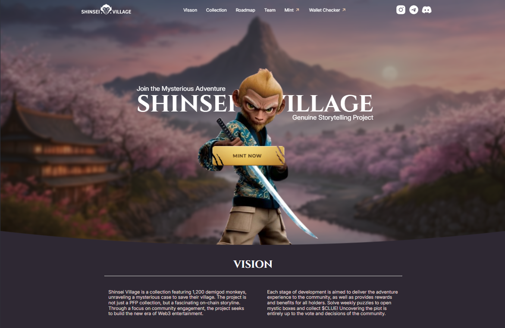

# Shinsei Village - Landing Page

A high-fidelity landing page for the **Shinsei Village** Web3 project, built as a milestone assignment for **Sheryians Coding School Cohort 3.0**.

---

## 🛠️ Technical Implementation

This project focuses on translating immersive, high-end visuals into a functional web interface using fundamental CSS techniques.

* **Layout:** Utilized **Flexbox** for responsive navigation and content distribution.
* **Positioning:** Employed precise absolute and relative positioning to manage image layering and cinematic typography placement.
* **Viewport:** Layout is only for desktop screen 

---

## 💻 Tech Stack
- **HTML5:** Semantic structure.
- **CSS3:** Advanced Flexbox and positioning.
- **JavaScript:** Currently in development (Fundamentals integration).

---

